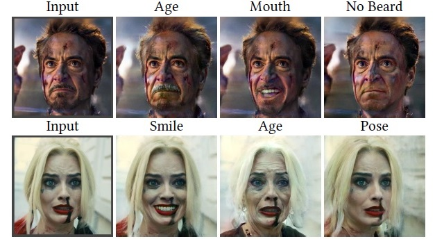
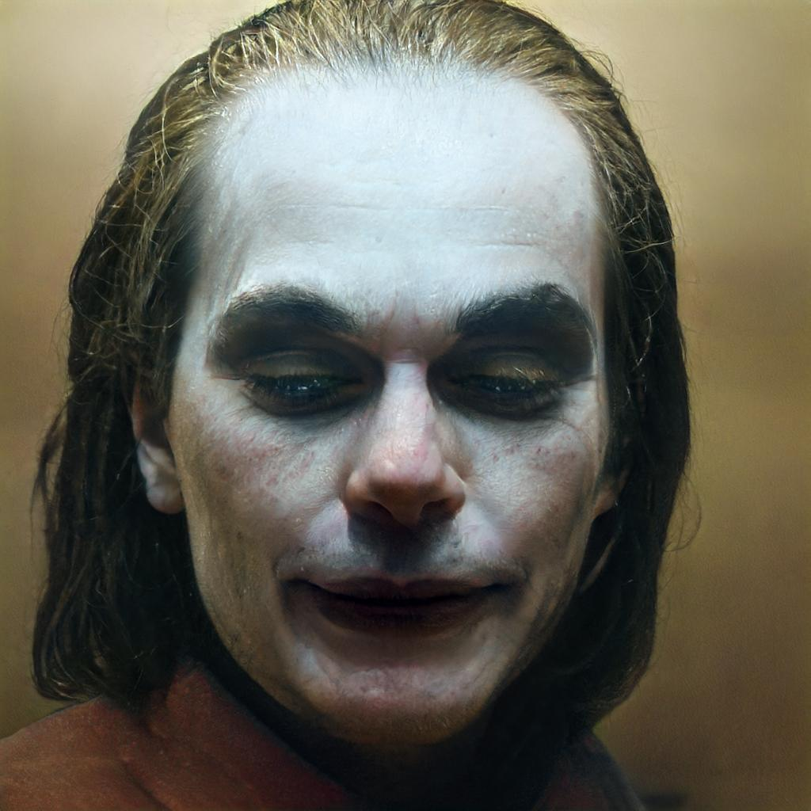
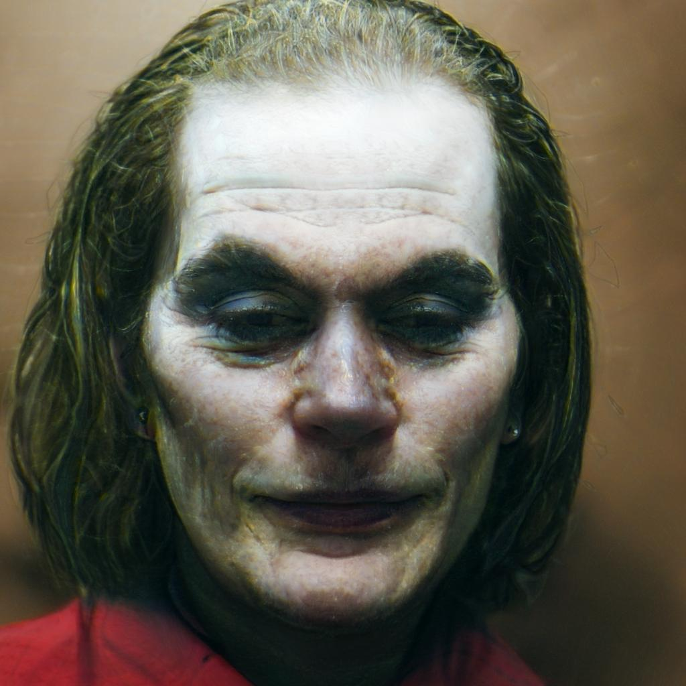

# Jittor version: Pivotal Tuning for Latent-based editing of Real Images (PTI)

**Pivotal Tuning for Latent-based editing of Real Images**  
Daniel Roich, Ron Mokady, Amit H. Bermano, Daniel Cohen-Or. In [ArXiv](https://arxiv.org/abs/2106.05744).

<p align="center">

</p>

The original page: [Project Page](https://github.com/danielroich/PTI)

## Notes
We implement the PTI inversion method for facial images, both for StyleGAN2 and StyleGAN3. 
The official weight are converted to jittor for StyleGAN2 and StyleGAN3 generator. 

The Google Drive link of StyleGAN2 and StyleGAN3 generator weight: https://drive.google.com/drive/folders/1SIY2O6_lQ4Dl8RSWwcjRzSuMnrYVBhU9?usp=sharing

The e4e weight could be downloaded from [Jittor e4e inplementation](https://github.com/ty625911724/Jittor_E4E)
Download all the weights and put them in `./weights/` directory. 

The LPIPS jittor is also required. Download the weights form [Jittor LPIPS inplementation](https://github.com/ty625911724/Jittor_Perceptual-Similarity-Metric) and put them in `./lpips/weights/` directory. 

## Quick start

### StyleGAN2

Check the `./configs/paths_config.py`, the `e4e` parameter is the path of e4e StyleGAN2 weight. Then run: <br>
```
python run_pti_stylegan2.py
```

<table>
<tr>
<th>&nbsp;</th>
<th>Original</th>
<th>Direct project</th>
<th>PTI</th>
</tr>

<!-- Line 1: Original Input -->
<tr>
<td><em>W</em></td>
<td></td>
<td></td>
<td></td>
</tr>
</table>

The `first_inv_type` parameter in `./configs/hyperparameters.py` could be changed to `'w+'`, then the pivot code will be generated using e4e.

<table>
<tr>
<th>&nbsp;</th>
<th>Original</th>
<th>Direct project</th>
<th>PTI</th>
</tr>

<!-- Line 1: Original Input -->
<tr>
<td><em>E4E</em></td>
<td></td>
<td></td>
<td></td>
</tr>
</table>


### StyleGAN3

Check the `./configs/paths_config.py`, the `e4e` parameter is the path of e4e StyleGAN3 weight. Then run: <br>
```
python run_pti_stylegan3.py
```

<table>
<tr>
<th>&nbsp;</th>
<th>Original</th>
<th>Direct project</th>
<th>PTI</th>
</tr>

<!-- Line 1: Original Input -->
<tr>
<td><em>W</em></td>
<td></td>
<td></td>
<td></td>
</tr>
</table>

The `first_inv_type` parameter in `./configs/hyperparameters.py` could be changed to `'w+'`, then the pivot code will be generated using e4e.

<table>
<tr>
<th>&nbsp;</th>
<th>Original</th>
<th>Direct project</th>
<th>PTI</th>
</tr>

<!-- Line 1: Original Input -->
<tr>
<td><em>E4E</em></td>
<td></td>
<td></td>
<td></td>
</tr>
</table>

## Acknowledgements

This repository borrows partially from the [original codes](https://github.com/danielroich/PTI), [Sketch_GAN](https://github.com/maxminder/gansketching_reproducing), [StyleGAN3_jittor](https://github.com/ty625911724/Jittor_StyleGAN3), [StyleGAN3_e4e](https://github.com/ty625911724/Jittor_E4E), [LPIPS_jittor](https://github.com/ty625911724/Jittor_Perceptual-Similarity-Metric) repository.
